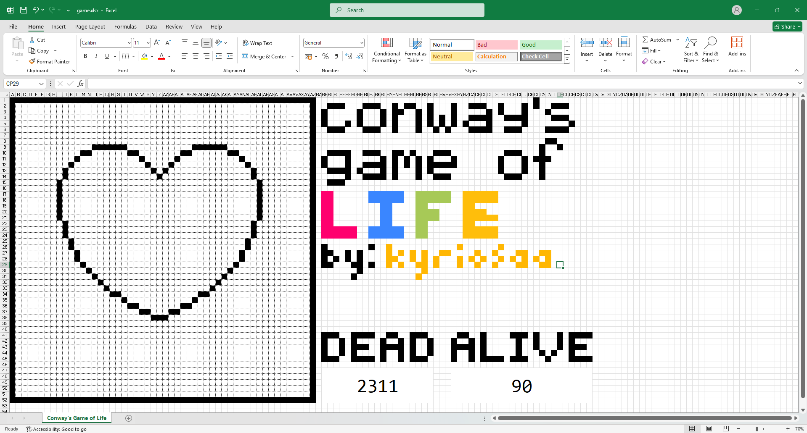

# Conway's Game of Life... on Excel

Just a fun project I did when I was bored. Really helped me understand the `win32` API though.

<br/>

**Basically, Conway's Game of Life's rules are as follows:**

```text
1. Underpopulation: A live cell with <2 live neighbors dies

2. Survival:        A live cell with 2 or 3 live neighbors lives

3. Overpopulation:  A live cell with >3 neighbors dies

4. Reproduction:    A dead cell with exactly 3 live neighbors becomes live
```

_All changes happen simultaneously for each generation based on its 8 adjacent neighbors_

---

You can load in [predefined patterns](https://github.com/kyriosaa/xlwings-gameoflife/tree/main/patterns) by running the [builder.py](https://github.com/kyriosaa/xlwings-gameoflife/blob/main/builder.py) script. Alternatively, you can just make your own pattern in the excel file (white=0, black=1).

Once you have your pattern, just run the [engine.py](https://github.com/kyriosaa/xlwings-gameoflife/blob/main/engine.py) script and the game will start.

> Make sure your game.xlsx file is open before running any of the scripts.